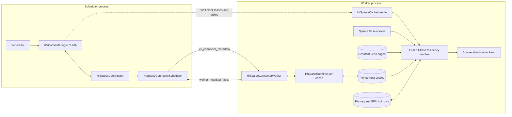
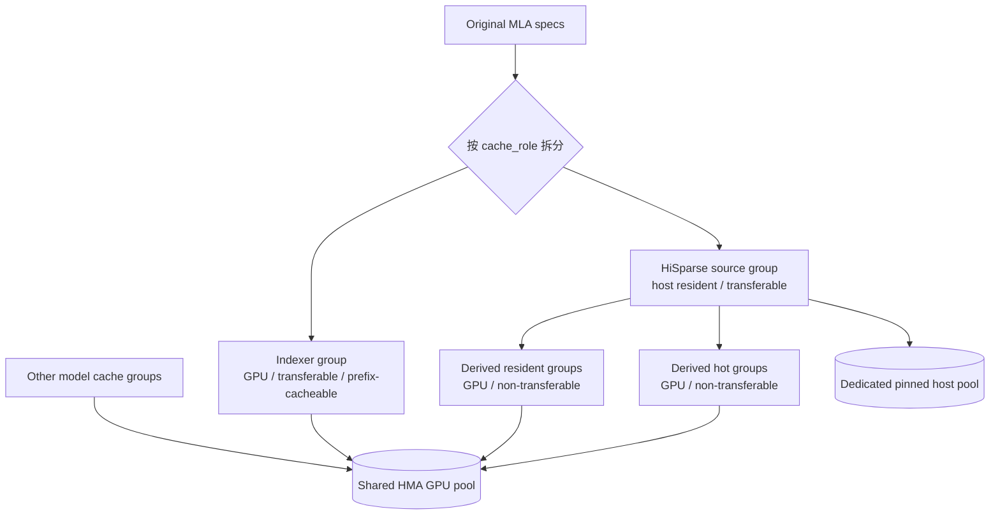
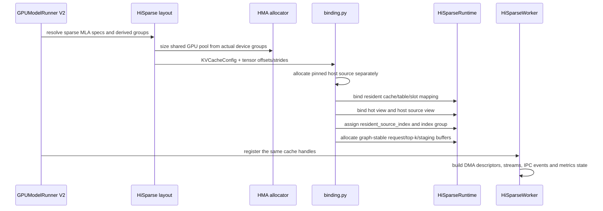
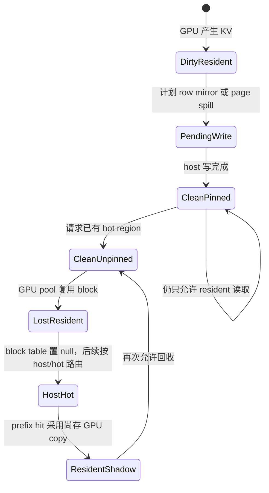
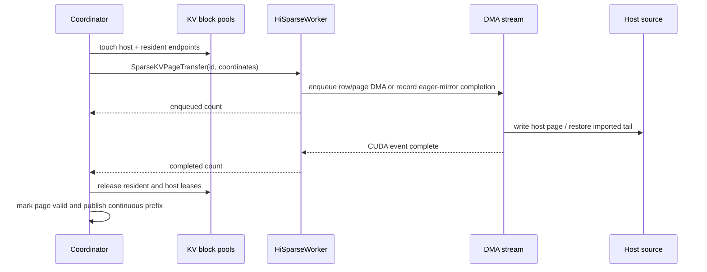
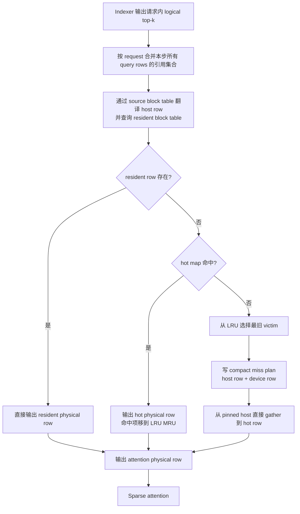
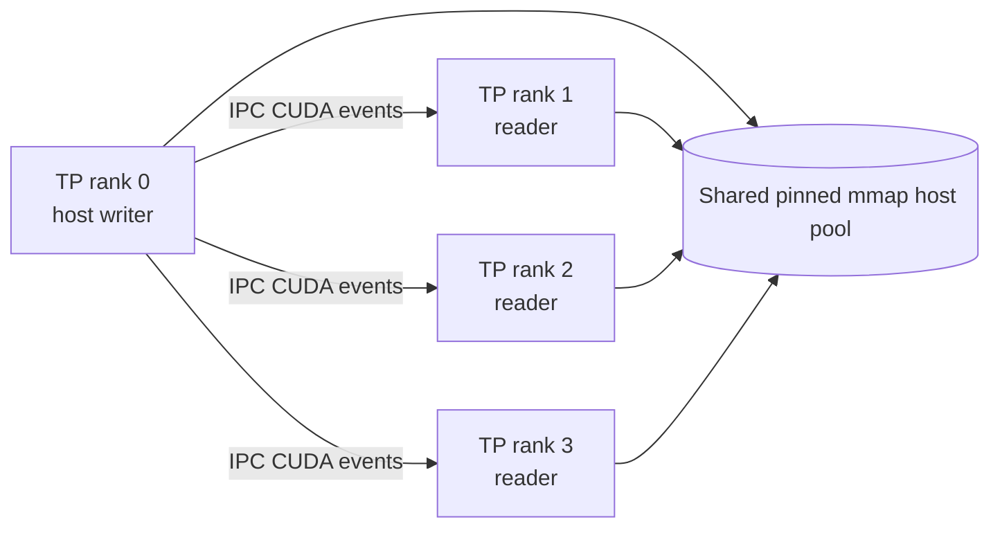

# HiSparse 特性详细设计与修复演进

> 文档基线：分支 `logprobs-replay`，提交 `4f4a8f78f90b5f0f0000f03de38012fd0ecfa31f`，整理日期 2026-10-07。
> 状态：HiSparse 在当前代码中仍标记为 experimental；本文以实际代码为准，并补充主线提交中的修复演进。

## 1. 摘要

HiSparse 面向带稀疏 MLA/DSA 索引器的模型。它利用“每次注意力只访问 top-k 历史位置”这一事实，把完整 sparse-MLA KV 的权威副本放在 pinned host memory，仅在 GPU 上保留：

1. 正在写入、尚未安全落盘或仍可直接复用的 resident pages；
2. 每个进入 host-backed 阶段的请求的一小块 hot buffer；
3. 仍由普通 GPU KV cache 管理的 indexer KV。

decode 时，索引器先产生请求内逻辑 top-k 位置。融合 CUDA resolver 按 resident → hot → host 的顺序解析每一行：resident 命中直接返回 GPU 行；hot 命中更新设备端 LRU；host 命中则选择 LRU victim，把所需行直接从注册过的 host 内存搬到 hot buffer，再把物理行号交给 sparse attention backend。

该方案的关键不是一个单独的“CPU KV connector”，而是调度器、HMA、KV connector、attention backend 与 CUDA kernel 共同完成的分层缓存协议：

- `HiSparseCoordinator` 掌握逻辑 host block、prefix identity 和 residency 状态机；
- 普通 KV cache manager/HMA 掌握共享 GPU block 的分配；
- `HiSparseConnector` 只传递每步命令和确认；
- `HiSparseWorker` 执行页级/行级数据搬运；
- `HiSparseRuntime` 和 `HiSparseCacheHandle` 把 host/hot/resident 路由接入 attention；
- CUDA kernel 在不引入 CPU 判定和 device scalar readback 的前提下完成 top-k 解析、LRU 和 host→GPU 行拷贝。

## 2. 目标与非目标

### 2.1 目标

- 用大容量 host 内存承载完整 sparse-MLA KV 历史，扩大可服务上下文和并发。
- GPU 只缓存当前活跃写窗口和 top-k 热行，降低单请求 GPU KV footprint。
- 保持 sparse attention 的输入仍是 GPU cache + physical row IDs，不侵入 attention kernel 的主体接口。
- prefix cache、chunked prefill、MTP/speculative decode、P/D KV 导入、TP 等场景中保持 KV 正确性。
- residency 决策、LRU 更新和 miss plan 均留在 GPU，decode 路径可被 CUDA Graph 捕获。
- 与 `MultiConnector` 组合，使 indexer KV、P/D 传输或通用 offloading 各自保留明确的所有权。

### 2.2 非目标与当前边界

- 不是通用 dense attention CPU offload；当前要求模型具有 `index_topk`，且 cache layout 能拆出 sparse MLA source 与 indexer。
- 不把 indexer KV 私有复制到 HiSparse host pool；indexer 仍是普通、可 prefix-cache 的 GPU group。
- 不支持 ROCm HiSparse data plane；融合 cache ops 目前是 CUDA 实现。
- 不支持 pipeline parallelism 或 decode context parallelism。
- 不支持 DeepSeek V4 的压缩 sparse-MLA cache 形态。
- 不支持全局 `cudagraph_mode=FULL`；允许默认的 `FULL_AND_PIECEWISE`，其中纯 decode batch 仍可走 full graph。

## 3. 总体架构



### 3.1 三类所有权必须分开

| 对象 | 所有者 | 说明 |
| --- | --- | --- |
| host block ID、token hash、prefix identity | `HiSparseCoordinator` / `HiSparseSourceManager` | 这是逻辑缓存身份，worker 不分配或释放它 |
| resident/hot/indexer GPU blocks | 普通 KV cache manager + HMA | 所有 device group 共用一个物理 GPU pool |
| host/hot/resident 字节视图与搬运 | `HiSparseWorker`、`HiSparseRuntime` | 按 scheduler 下发的物理坐标执行，不解释请求身份 |
| top-k 逻辑位置 | sparse indexer | 请求内 token position |
| top-k 物理位置和 LRU | CUDA resolver | 解析成 resident 或 hot cache 可消费的物理行 |
| prefix 对外可见时机 | `HiSparseCoordinator` | 只有 host 数据 durable 后才能发布 |

这个分层避免了两个常见错误：一是把 host source group 当成普通 GPU pool；二是让 worker 持有请求生命周期和 prefix identity，造成 scheduler/worker 双重真相。

## 4. KV cache 分组与内存布局

启用 HiSparse 后，原 sparse-MLA group 会被重排为下列逻辑组：



### 4.1 Source group

- role 为 `HISPARSE_SOURCE`，`host_resident=True`，`enable_kv_transfer=True`。
- 保存 sparse MLA 的完整 KV；它是 prefix cache 的权威来源。
- 使用独立 `SharedEventQueueBlockPool`，不参与 GPU pool 的容量和 device residency metrics。
- host block 不允许 best-effort：每个已计算 page 必须有 host backing，否则本次 admission 被延迟。这样任意 resident page 都能写回并最终回收。

### 4.2 Indexer group

- role 为 `HISPARSE_INDEXER`，仍是普通 GPU group。
- `enable_kv_transfer=True`，可被 NIXL 或通用 `OffloadingConnector` 传输。
- HiSparse 不为它维护第二份私有 CPU cache。
- source host prefix 与 indexer prefix 可以命中不同长度；组合 offloader 时，仅恢复缺失的 indexer suffix，并以上游 host prefix 为上限。

### 4.3 Resident groups

- `HiSparseResidentSpec`，不可 prefix-cache，不能独立对外传输。
- 是 host source 的 GPU write-back/shadow pages。
- admission 只为 in-flight window 预留，而非按 `max_model_len` 永久占满。
- durable 且请求已获得 hot region 后，sealed page 可以 unpin；block table 暂时仍可引用它，直到 pool 真正复用该 block。复用回调会把旧 owner 的表项改成 null 并发布 block-table update。
- 为防止当前 forward 写入中的页被过早回收，尾部 `ACTIVE_TAIL_PAGES=2` 始终保留。

### 4.4 Hot groups

- `HiSparseHotSpec`，每个请求固定 `blocks_per_request`，不可 prefix-cache、不可外传。
- 只有请求需要从 host 读取历史时才分配；纯 resident 请求无需支付 hot footprint。
- 每个 index-sharing group 共用 logical top-k、LRU、miss plan；不同 layer 仅重放各自的字节 gather。

### 4.5 HMA 物理叠加

device groups 共享 block-outermost 的 HMA backing。一个 block ID 同时只能由一个 group 拥有，因此 indexer、resident、hot 和其他兼容组可以叠加同一物理池。host source 单独分配，不允许因 host 容量被计入 GPU 利用率而污染 device residency 指标。

布局阶段还会：

- 为所有 sparse attention/indexer backend 选择共同 kernel block size；
- 按 indexer page 大小把相关 hot/resident layer 打包成 group；
- 保留每层 `offset + layer_index * layer_stride`，而不是错误复用 tensor 起始 offset；
- 要求 resident 与 hot 的 storage、data pointer 和 stride 相容；
- host pool 至少容纳 `ceil(max_model_len / block_size) + 2` 个 block（null block 与 COW tail 也要留空间）。

## 5. 配置、启用和启动校验

最小配置示例：

```json
{
  "kv_connector": "HiSparseConnector",
  "kv_role": "kv_both",
  "kv_connector_extra_config": {
    "host_pool_gib": 32
  }
}
```

配置 `HiSparseConnector` 后，`AttentionConfig.hisparse_config` 会自动以默认值补齐。只有需要调参时才显式设置：

```json
{
  "hisparse_config": {
    "device_buffer_size": 512,
    "eager_host_mirror": true
  }
}
```

| 配置 | 默认值 | 语义 |
| --- | --- | --- |
| `host_pool_gib` | 必填 | 每个 data-parallel replica 的逻辑 host cache 容量，不是整节点总预算 |
| `device_buffer_size` | `(max_decode_query_len + 1) * index_topk` | 每请求 hot rows；必须至少覆盖 `max_decode_query_len * index_topk` |
| `eager_host_mirror` | `true` | decode 新写 KV 在 forward 中同步镜像到 host；关闭时在 page spill 时再整页 D2H。prefill 始终镜像 |

`device_buffer_size` 还有两个硬限制：

- hot slot 使用 `int16`，最大为 32768 rows；
- resolver 的共享内存大小与 `max_union_rows`、hot rows 成正比，启动时会按设备 shared-memory 上限拒绝不合法配置。

启动时还会强制检查：

- NVIDIA CUDA；
- Model Runner V2；
- pipeline parallel size = 1；
- decode context parallel size = 1；
- hybrid KV cache manager 开启；
- `scheduler_reserve_full_isl` 开启，避免异步 host load 互相占住资源形成死锁；
- 非全局 `cudagraph_mode=FULL`；
- 模型含 `index_topk`；
- source/indexer 均存在、MLA spec 均匀、GPU block size 唯一；
- device cache 为 block-outermost layout；
- host pool 为正、能放下一条 `max_model_len` 请求，并且实际 RAM 有余量。

当前代码明确拒绝 DeepSeek V4。代码和测试实际覆盖的代表模型/路径包括 DeepSeek-V3.2 与 `nvidia/GLM-5.2-NVFP4`；后者有 4×B200 nightly GSM8K accuracy job。E2E 测试还把 sparse MLA 硬件覆盖限定在 Hopper 或更新架构。

## 6. 初始化与绑定流程



几个实现细节很关键：

- `resolve_hisparse_specs()` 在真正做容量估算前先解析共同 block size，再派生 resident/hot specs。
- GPU pool 只按 HiSparse 实际分配的 device groups 计算；否则派生 spec 与原 spec 重复计费会低估可分配 blocks。
- `PagedCacheView` 通过 `byte_offset`、`block_stride`、`layer_stride` 在共享 raw tensor 上建立 3D view；attention 若需要无 padding 的行号，还会建立 `attention_cache` 和 `attention_block_stride`。
- graph-stable `request_state_indices` 把动态 input-batch row 映射到持久的 per-request hot/LRU 状态，batch compact/reorder 时原地刷新。
- profiling/cudagraph capture 结束后显式释放 pinned host state，避免超大注册区在真实初始化前一直占用。

## 7. 请求生命周期与 residency 状态机

### 7.1 Page 状态



`_HiSparseRequestState` 维护：

- `valid_pages`：host copy 已完成；
- `ready_prefix_pages`：从第 0 页起连续 durable 的前缀页数；
- `pending_pages`：正在执行的 transfer ID；
- `pinned_clean` / `unpinned_pages`：clean resident page 是否仍持有 allocation reference；
- `publication`：等待 durable 前缀的发布事务；
- `pages_to_adopt`：prefix hit 后要在 admission 完成再采用的 GPU shadow pages。

### 7.2 从 resident 过渡到 host-backed

请求不会一开始就分配 hot region。以下任一条件触发 `require_hot()`：

- 外部导入的 prefix 需要从 host 读取；
- 本地命中 host prefix，但该请求没有 resident 历史；
- 共享 GPU pool 低于 watermark；
- 请求已占满 admission 为 resident window 预留的 blocks。

hot region 真正由下一个 scheduling pass 分配。在 hot region 就绪前，clean resident pages 仍保持 pinned，防止请求失去唯一可读副本。hot 就绪后才逐页 unpin。

### 7.3 Prefix 发布

host page 只有在 worker 报告写入完成后才进入 `valid_pages`。`ready_prefix_pages` 只沿连续前缀推进，`publish_blocks()` 只发布这一段 durable prefix。

长 chunked prefill 不等待整个 prompt 完成才发布：每个已完成 chunk 的连续页都会增量发布。否则中途 preemption 会从头重算，甚至在固定 admission window 下形成 livelock。

请求结束时如果仍有 pending pages，coordinator 会把 host blocks 与 publication 脱离 request 生命周期并额外持有 lease；最后一个确认到达后再完成 prefix hash 发布。若是 preemption/取消而非正常结束，则丢弃未被证明已计算完成的 publication。

## 8. 每步 scheduler ↔ worker 协议

### 8.1 Scheduler 下发

`HiSparseConnectorMetadata` 包含：

| 字段 | 用途 |
| --- | --- |
| `command.page_transfers` | page spill 或 host-import tail restore |
| `host_block_copies` | host prefix COW copy |
| `source_block_ids` | 本步新分配/复用的 host blocks，用于使旧 hot slot 失效 |
| `row_mirrors` | 请求维度的 resident row span → host row span envelope |
| `all_context_pages_resident` | attention 是否可跳过 host prefill staging |

构建 metadata 前，scheduler 先执行 `advance_scheduled()`：为即将完成的 sealed pages 规划 materialization、推进 residency、生成必要 block-table updates。顺序不可颠倒，否则本步 worker 会看到旧表或少一拍的 transfer plan。

### 8.2 Worker 回传

`HiSparseConnectorWorkerMetadata` 回传：

- 各 transfer 在多少 worker 上已 enqueue；
- 各 transfer 在多少 worker 上已 complete；
- 已执行的 host COW destination IDs。

多 worker 聚合时 transfer 采用计数，host COW 因每个 worker 执行同一逻辑 copy 而取 ID 并集。

### 8.3 Spill/restore 事务



注意：当前实现中 `expected_worker_completions` 由 enqueue count 建立，但 `_apply_enqueued_spills()` 实际等待 `worker_completions >= expected_worker_completions` 后才释放 resident lease。现有 `docs/design/hisparse.md` 中“enqueue 后即可依靠 stream ordering 释放”的文字与这段现行代码并不完全一致；本文按当前实现描述，即完成确认是实际释放门槛。这是后续维护文档时应统一的地方。

### 8.4 Row mirror 与 page spill

- prefill 总是做 host mirror；decode 由 `eager_host_mirror` 决定。
- scheduler 只给出可镜像的连续 span envelope，worker 再用实际 GPU `slot_mapping` 筛选真正写过的 rows 并合并连续 DMA descriptor。
- layer 在完成自身 KV update 后触发 mirror；同一 resident source group 的相邻 layer 合并批量 DMA。
- eager mirror 开启时，后续 page transfer 不需要重复 D2H，只需用 event 确认该页的行镜像已经完成。
- eager mirror 关闭时，在 spill 时按 page×layer 生成 batch DMA descriptors。

## 9. Decode 热缓存解析



### 9.1 为什么按 request 做 union

MTP/speculative verification 会让同一请求在一步内产生多行 top-k。如果逐行独立做 LRU，同一个 host row 可能重复加载，后一行还可能逐出前一行本步仍要读的数据。当前 kernel 让同一请求连续行中的第一行成为 leader，在 shared memory 中构建 union hash table：

1. 翻译每行逻辑位置，resident hit 直接完成；
2. 将剩余 host rows 去重；
3. 扫描 hot LRU，把 union 中已有的 rows 标成 hit；
4. 按首次引用的 `(row, top-k)` 顺序为 miss 分配 victim，保证确定性；
5. 生成 compact host-row/device-row arrays；
6. follower layers 重放同一 miss plan，只拷贝各自层的数据。

这样同一 step 的多行不会互相驱逐，且一个共享 host row 只计一次实际 load。

### 9.2 GPU 持久状态

- `device_global_indices[max_num_reqs, region_stride]`：hot slot 当前对应的 host global row；
- `lru_slots[max_num_reqs, hot_size]`：`int16` LRU 顺序；
- `request_state_indices`：input batch row → 持久 request-state row；
- `physical_topk_indices`、`swap_*`、`swap_counts`：固定容量的 graph-safe workspace；
- `swap_stats[2]`：设备侧 hit/miss 累计。

新 KV 写入或 host block 被复用时必须失效旧 hot mapping，防止 newest-write 或 recycled slot 继续命中陈旧字节。kernel 对异常 LRU slot 也有边界保护：将其退化为 invalid/miss，而不是产生越界读写。

### 9.3 Resident fast path

resident block table 查询在 resolver phase 1 内完成。若某请求本步所有 top-k 都 resident，则 kernel 在扫描 hot LRU 前直接返回；不增加第二个 framework route、CPU 分支或独立 CUDA graph。

## 10. Prefill、混合 batch 与量化 KV

decode workspace 是固定小容量，长 prefill 不能直接套用同一 hot resolver。HiSparse 对 prefill 的策略是：

1. 根据 host block table 找出当前 prefill 引用的 unique blocks；
2. 生成无 data-dependent output allocation 的 compact staging block table；
3. 若某 host block 仍有 resident shadow page，优先做 D2D gather；
4. 其余 rows 从 host gather 到临时 GPU staging cache；
5. sparse attention 使用 remapped block table 和 staging cache。

FP8 DeepSeek MLA row 使用 656 bytes（512B quantized NoPE + 16B scales + 128B RoPE）。FP8 prefill gather 可在专用 side stream 上完成，并在 gather 时 upconvert。BF16、FP8、混合 prefill/decode batch 均有专项测试。

启用 HiSparse 后，short prefill 不再切换 sparse MHA fast path，而统一走 sparse MQA/可 staging 的语义，避免 host-backed 历史与 MHA 路径的 cache contract 不一致。

## 11. CUDA Graph 与异步流同步

HiSparse 依赖固定 shape 的持久 workspace、request-state indirection 和 side-stream event 来保持 graph capturable：

- logical top-k 在 compute stream 产生；residency resolver 和 host gather 在 copy/side stream 执行；
- eager 模式使用 event；piecewise graph 内不能等待 graph-local event 时回退到 stream dependency；
- CUDA Graph padding row 的 request ID 会在 copy stream 上改写为 `-1`，resolver 将其输出置 `-1`，避免 padding 污染 request 0 的 LRU；
- `FULL_AND_PIECEWISE` 可让 decode full graph 与 eager/piecewise 边界配合；全局 `FULL` 会冻结依赖运行时 residency 的路径，因此启动即拒绝。

MTP draft layer 的写入发生在 target forward 之后。worker 不在 target `finish_forward()` 时镜像 draft layer，而是在下一步 `start_step()` 开头、drafter 已经完成后镜像；post-forward transfers 排在 draft mirror 之后。这个顺序保证页面不会在 draft KV 到达 host 之前被宣告 clean 或释放 resident block。

## 12. TP、P/D 与其他 connector 组合

### 12.1 单机 TP host pool 共享

在单节点 MP、仅 TP、无 PP/PCP/DCP 的拓扑中，所有 TP rank 映射同一 `SharedOffloadRegion`：



MLA source KV 在 TP ranks 上语义等价，因此只需一个物理 host 副本：rank 0 写 host，其他 ranks 用 IPC event 等待。其他 executor/并行拓扑使用每 rank 私有 host pool。`host_pool_gib` 始终表达每 DP replica 的逻辑容量，不能据此直接推断节点物理内存消耗。

共享 region 按 OS page 对齐并按最多 256 GiB 注册 chunk 切分；边界不得切断任何 tensor 的 host block，否则 batch copy descriptor 会跨 CUDA registration range。

### 12.2 P/D 导入

decoder 在 admission 时一次性选择导入目标：

- 完整 prefix 能放入 device groups：直接导入 resident GPU pages；
- 否则，只要 host blocks 与固定 host-backed GPU footprint 可容纳：导入 host source；
- 容量不足则等待，重试时保留原选择，不用 context-length heuristic 改道。

host import 通过有界 decoder-GPU staging，再拷入已注册 host memory；立即需要的尾页会 restore 到 resident page，使 decode 能继续写入，而无需在 D 端重做 tail prefill。

NIXL 为此增加了 transferable-group 选择、per-region geometry、DRAM/GPU mixed regions，以及不同逻辑 block size 下按 token position 对齐的 pull。region mapping 不再假设“每个 region 都有同样 block 数”或“本地未命中 suffix 等于远端列表尾部”。

### 12.3 MultiConnector

- `HiSparseConnector + OffloadingConnector`：HiSparse 管 sparse MLA source/resident/hot；通用 offloader 管 indexer group。
- `HiSparseConnector + NixlConnector`：NIXL 负责 P/D source/indexer 导入，HiSparse 负责本地 host tier 与 decode hot buffer。
- `MooncakeStoreConnector` 是另一条已标记为验证过的共享存储组合路径。

## 13. 监控与容量口径

Prometheus 指标：

| 指标 | 类型 | 含义 |
| --- | --- | --- |
| `vllm:hisparse_cache_hits` | Counter | device hot-buffer hits |
| `vllm:hisparse_cache_misses` | Counter | device hot-buffer misses |
| `vllm:hisparse_host_to_device_bytes` | Counter | host → hot buffer 字节数 |
| `vllm:hisparse_host_cache_usage_perc` | Gauge | host KV pool 使用率，1 表示 100%；可驱逐 cached blocks 按 free 计 |
| `vllm:hisparse_pending_page_transfers` | Gauge | 尚未完成的 write-back/restore 数量 |

worker 每 2000 次 stats 调用异步快照 GPU hit/miss 计数，避免频繁同步。scheduler 侧上报 host pool usage 和 pending transfers。

启动日志有两个不同并发上界：

- generic `Maximum concurrency`：每个请求按完整 admission footprint 计费；
- `HiSparse steady-state maximum concurrency`：已运行的 host-backed 请求，其 resident group 只按 active tail pages 计费，同时保留一个请求的完整 admission footprint。

steady-state 仍受 host blocks 和 GPU blocks 两者较小值约束，不能只看 host 容量。

## 14. 代码修复与演进

### 14.1 基础系列

| 提交 | 内容 | 设计影响 |
| --- | --- | --- |
| `d85708f7a4` `[1/N]` | 为 KV group 增加 `enable_kv_transfer` 及 transfer group 选择 | resident/hot 可明确排除在外部传输之外 |
| `e0aaef85f3` `[2/N]` | NIXL 支持 per-region geometry、group mapping、mixed memory type | 为 host source + GPU indexer 的异构布局打基础 |
| `d43bb2f37f` `[3/N]` | HiSparse 主体：layout、coordinator、worker、runtime、CUDA ops、backend 接入、E2E | 完成本地 host-resident sparse MLA hot-buffering |
| `29332cf936` `[4/N]` | connector stats 与 Prometheus 指标 | 建立 hit/miss/H2D 可观测性 |
| `e19a3e172e` `[5/N]` | 单机 TP ranks 共享 host cache | 降低 TP 下的物理 host 内存放大 |

### 14.2 正确性与性能修复

| 提交 | 失效场景/根因 | 修复内容 |
| --- | --- | --- |
| `df42d112ee` | 只配 connector 未显式配 attention 时 feature 未完整启用 | 从 `HiSparseConnector` 自动推导默认 `HiSparseConfig` |
| `38ca7a899c` | 多层共享 tensor 时，每层都绑定到 tensor 起始 offset，读写层数据串位 | 绑定时加入 `layer_index * layer_stride` |
| `804e5377aa` | P/D 两端 cache group 或逻辑 block size 不同，region pull 用列表尾部对齐会错页，未覆盖 padding 未清零 | 传递 remote token count，按 region 和 token position 配对，并记录需清零的本地 region blocks |
| `67e5b0acc9` | full-block import 后仍在 D 端 tail prefill，既重复计算又可能覆盖/错位 | host 导入后把最后一页 restore 到 resident，保留可写 tail，直接进入 decode |
| `2798f66860` | MTP 多 verification rows 各自解析 LRU，重复 host load 且本步内互相逐出 | per-request union resolver、compact miss plan 与 follower replay |
| `90e13fc757` | host pool 满时仍允许 GPU-only page，破坏“任何 resident page 均可回写”的回收前提；异步 admission 还能死锁 | 所有 page 强制 host backing；容量不足延迟请求；host pool 启动最小容量校验；强制 full-ISL reservation |
| `ff1b87cca2` | 请求结束早于 DMA ack，request state/free blocks 被销毁，最终 host prefix 永远不发布 | publication 与 request 解耦，保留 detached block leases，最后 ack 后发布 |
| `3eb6cec22a` | prefix hit 在 admission allocation 前先采用 GPU shadow copy，额外 pin 会破坏 admission 计数 | 延迟到 `update_residency()`，在本次分配完成后再 adopt |
| `73c7cae4d7` | host 私有 pool 被普通 GPU residency metrics collector 统计 | host pool 的 metrics collector 置空，共享 event queue 但不共享 device 指标 |
| `3a69636645` | chunked prefill resident window 达到 admission cap 后仍不转 host/hot，后续 chunk 无 block、反复 preempt | 达到 `max_admission_blocks_per_request` 即申请 hot；durable prefix 增量发布 |
| `ca65eb67d9` | 每步从第 0 页重扫 prefix，并在多处重复推进 residency | 以 `ready_prefix_pages` 为扫描起点；把每步推进集中到 metadata 构建前的 `advance_scheduled()` |
| `f7999d2e44` | KV pool sizing 仍按派生前/重复的 groups 计费，HMA blocks 数不正确 | 从 HiSparse 实际分配的 groups 重新 layout 和 sizing；derived specs 不再重复影响容量 |
| `4056c8ac1f` | saturated GPU pool + MTP + full decode graph 时 acceptance 崩溃；padding request mapping 有 stream race；draft rows 过早镜像 | request-ID/padding mask 移到 resolver copy stream；标记 draft layers 并延迟到下一步镜像；page handoff 排在其后 |
| `54d93af9fb` | 全局 FULL graph 会冻结依赖 residency 的动态路由，运行中才表现为错误 | 启动时 fail fast，要求 `FULL_AND_PIECEWISE` 或其他模式 |
| `2e3154aa18` | generic concurrency 无法表达 host-backed steady state；缺少 host tier 水位 | 增加 steady-state concurrency 日志及 host usage/pending transfer gauges |
| `e82b80099a` | `all_context_pages_resident()` 每步扫描所有 request×page×resident group | 缓存“上次全 resident”的 request set，仅在 import、prefix adopt、block reuse、free 等失效点清除 |

### 14.3 从修复中提炼出的不变量

1. **先有 host backing，后有可回收 resident page。** 不能把 host allocation 当 best-effort。
2. **prefix identity 只能指向 durable bytes。** enqueue、request finish、prefix publish 是不同生命周期节点。
3. **admission 计算与实际 pin/unpin 次序必须一致。** shadow-copy adopt、hot allocation、resident cap 都不能偷偷改变 footprint。
4. **多行 speculative step 是一个 replacement transaction。** 对同一请求逐行更新 LRU 不正确。
5. **MTP draft KV 的生产时序晚于 target forward。** mirror 和 page handoff 必须按真实生产顺序排队。
6. **HMA tensor 绑定必须携带完整几何信息。** layer offset、block stride、attention stride、region block count 缺一不可。
7. **host source 与 GPU device groups 的指标、容量和 transfer eligibility 必须隔离。**
8. **所有性能缓存都要有明确失效点。** `_resident_requests` 的正确性依赖 null page 只在已列举事件上出现。

## 15. 测试与验证矩阵

| 层级 | 主要文件 | 覆盖内容 |
| --- | --- | --- |
| 配置 | `tests/test_config.py` | V2、CUDA、PP/DCP、FULL graph、HMA、full-ISL、connector 推导 |
| Layout/sizing | `tests/v1/core/test_kv_cache_utils.py` | resolved block size、host 最小容量、steady concurrency、DeepSeek V4 拒绝、derived specs 不重复计费 |
| Scheduler/prefix | `tests/v1/core/test_prefix_caching.py` | spill budget、host exhaustion、prefix publish、COW、preemption、GPU shadow adopt、external import |
| Connector | `tests/v1/kv_connector/unit/test_hisparse_connector.py` | metadata、HMA hooks、延迟 transfer、block-outermost 约束 |
| Worker | `tests/v1/worker/test_utils.py` | row mirror、DMA descriptor、shared TP writer、IPC/event ordering、MTP draft mirror、shutdown |
| Attention/kernel | `tests/v1/attention/test_sparse_mla_backends.py` | graph-stable mapping、union resolver、LRU/eviction、resident bypass、FP8/BF16 prefill/decode、各 backend |
| E2E | `tests/v1/e2e/general/test_hisparse.py` | spill + prefix restore、host exhaustion defer、terminal prefix reuse、MTP/full decode graph |
| Accuracy | `.buildkite/test_areas/lm_eval.yaml` | 4×B200 nightly，GLM-5.2-NVFP4 GSM8K |

测试设计把最危险的竞态拆到了最便宜层级：scheduler 状态机用纯单测，DMA/event 用 worker mock，CUDA LRU/union 用 kernel/backend 测试，完整模型只保留少量 E2E 与 nightly accuracy。

## 16. 关键代码索引

| 模块 | 文件 | 责任 |
| --- | --- | --- |
| 用户配置 | [`vllm/config/attention.py`](../vllm/config/attention.py) | `HiSparseConfig` |
| 启动校验 | [`vllm/config/vllm.py`](../vllm/config/vllm.py) | 平台、并行、graph、scheduler、model 检查 |
| cache spec | [`vllm/v1/kv_cache_interface.py`](../vllm/v1/kv_cache_interface.py) | hot/resident spec、group role、host fields |
| layout/sizing | [`vllm/v1/hisparse/layout.py`](../vllm/v1/hisparse/layout.py) | group 重排、HMA/host 容量、steady concurrency |
| worker 绑定 | [`vllm/v1/hisparse/binding.py`](../vllm/v1/hisparse/binding.py) | host 分配、tensor view、handle/runtime 绑定 |
| scheduler 状态机 | [`vllm/v1/hisparse/coordinator.py`](../vllm/v1/hisparse/coordinator.py) | prefix、residency、spill、publication |
| scheduler/worker 边界 | [`vllm/distributed/kv_transfer/kv_connector/v1/hisparse/connector.py`](../vllm/distributed/kv_transfer/kv_connector/v1/hisparse/connector.py) | 每步 metadata 与 ack 聚合 |
| 数据搬运 | [`vllm/distributed/kv_transfer/kv_connector/v1/hisparse/worker.py`](../vllm/distributed/kv_transfer/kv_connector/v1/hisparse/worker.py) | row/page DMA、TP writer、event 顺序 |
| attention data plane | [`vllm/v1/hisparse/runtime.py`](../vllm/v1/hisparse/runtime.py) | host/hot view、prefill staging、resolver 调用 |
| index sharing | [`vllm/v1/attention/backends/mla/index_group.py`](../vllm/v1/attention/backends/mla/index_group.py) | leader/follower、logical→physical top-k |
| CUDA ops | [`csrc/libtorch_stable/hisparse_kernels.cu`](../csrc/libtorch_stable/hisparse_kernels.cu) | union residency、LRU、gather、invalidate |
| KV managers | [`vllm/v1/core/single_type_kv_cache_manager.py`](../vllm/v1/core/single_type_kv_cache_manager.py) | source/hot/resident allocation contract |
| 现有上游设计说明 | [`docs/design/hisparse.md`](../docs/design/hisparse.md) | 简版 ownership 与代码边界 |

## 17. 风险、限制与后续建议

### 17.1 当前风险

- **Host bandwidth 是 miss 路径上限。** top-k locality 较差或 hot buffer 太小时，H2D bytes 会快速增长；应同时看 miss 和 H2D 指标。
- **Pinned memory 很大。** `host_pool_gib` 是逻辑容量，TP 是否共享会改变物理占用；多 DP replica 还会线性放大。
- **共享内存限制隐藏在 speculative 配置中。** 增大 speculative tokens 同时增大 union bound，可能导致启动拒绝或降低 occupancy。
- **跨 connector 组合复杂。** source/indexer prefix 长度不同、P/D region geometry、失败重算和通知顺序均需保持原有测试。
- **文档与实现存在一处 ack 语义漂移。** 应决定 resident lease 是在 enqueue 还是 complete 后释放，并统一代码注释、设计文档和测试命名。
- **平台扩展不是简单移植 kernel。** ROCm/其他平台需要同时实现 pinned allocator、copy semantics、replacement policy 和 attention-facing contract。

### 17.2 建议的后续工作

1. 为 spill transaction 定义一份机器可检查的状态枚举，消除 enqueue/complete 注释歧义。
2. 将 host pool 物理内存估算按 DP×TP/shared topology 输出到启动日志，减少运维误配。
3. 增加 hot hit ratio、H2D bandwidth 与 latency 的联合 dashboard，并按模型/上下文长度建立推荐 `device_buffer_size`。
4. 将 DeepSeek-V3.2、GLM-5.2 各 backend 的支持矩阵显式写入用户文档，而不是依赖代码分支推断。
5. 对 MultiConnector 的 source/indexer 双前缀恢复增加长期压力测试，覆盖失败、取消、preemption 和 host exhaustion 组合。
6. 若扩展到 ROCm，保持 `SparseKVOffloadCommand`、worker metadata 和 `HiSparseCacheHandle` 边界不变，只替换平台 allocator/copy/resolver。

## 18. 结论

HiSparse 的核心价值不是把全部 KV 简单搬到 CPU，而是把 sparse attention 的访问稀疏性转化成一个可调度的三级缓存：host source 提供完整、可复用的 prefix 身份；resident pages 负责安全生产和短期复用；hot buffer 只承载当前 top-k working set。它通过 HMA 共享 GPU 容量、GPU 端融合 residency/LRU、行级 eager mirror 与严格 publication 事务，在不改变 sparse attention 主体 contract 的前提下显著降低长期历史的 GPU 占用。

过去一系列修复说明，这类方案最难的部分不是单个 CUDA kernel，而是跨 scheduler、block allocator、worker stream、speculative timeline、prefix publication 与 P/D geometry 的一致性。后续任何改动都应先验证第 14.3 节列出的不变量，再分别从 scheduler 状态、数据几何和异步事件顺序三个维度审查。
